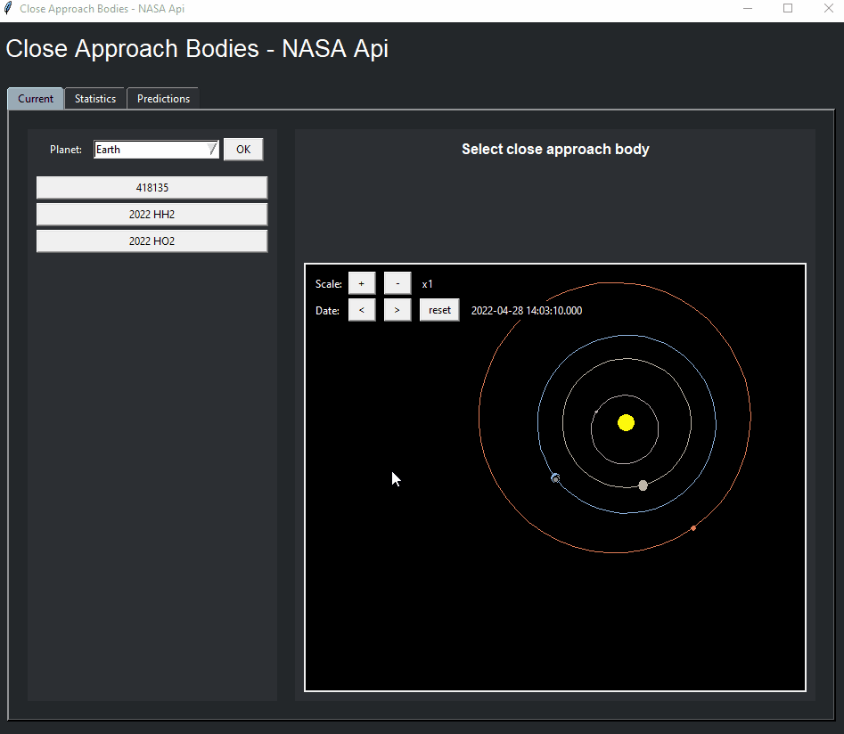
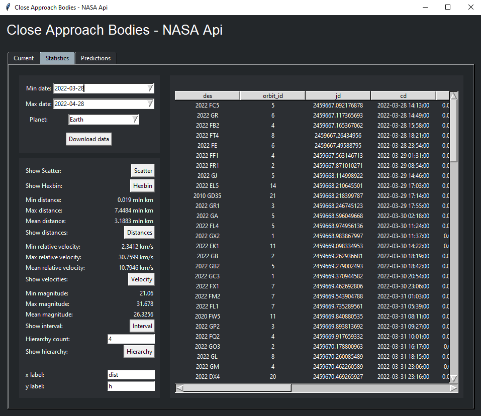
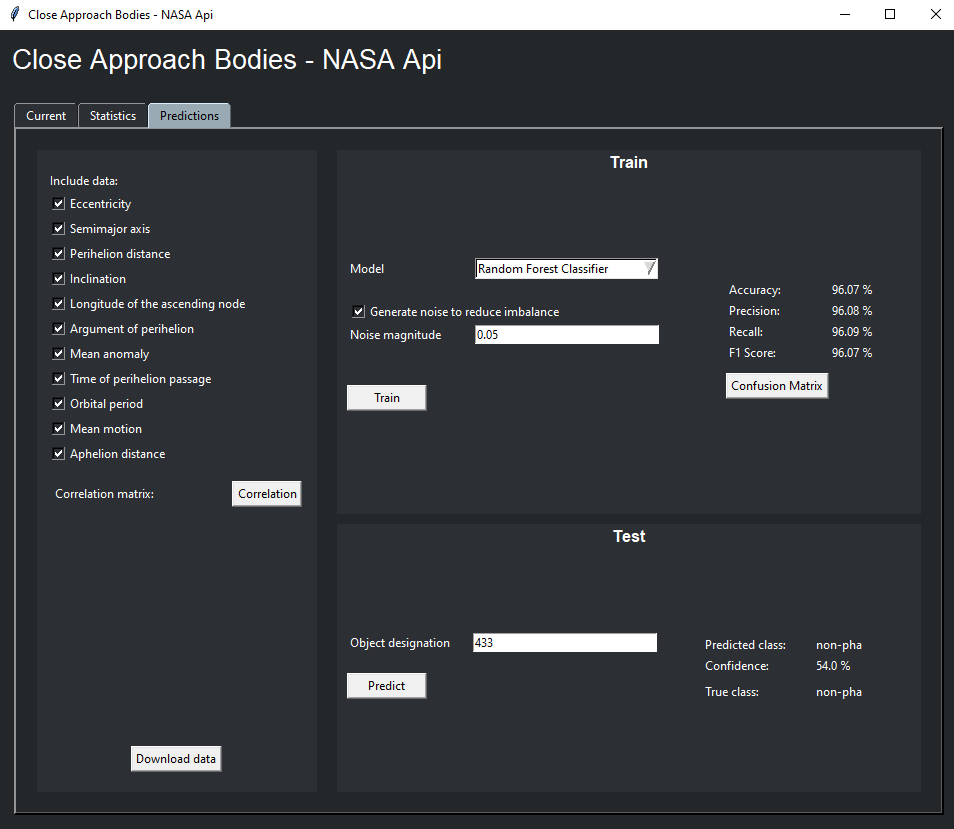

# Close Approach Bodies

This application has been created as a project for Big data and warehousing course ANS Tarnów 2021/2022

Program uses NASA APIs to download all necessary data.
<br>SBDB Close-Approach Data API: https://ssd-api.jpl.nasa.gov/doc/cad.html
<br>SBDB API: https://ssd-api.jpl.nasa.gov/doc/sbdb.html

## Features list:
* Visualisation of currently closest small objects to a given planet
* Statistics of closest approaches between given dates
* Simple prediction playground to train a machine learning model and predict whether a given small body qualifies as a PHA (Potentially Hazardous Asteroid)

## Images




## How to run
To run the program switch to /src folder
```
> cd src
```
And run app.py
```
> python app.py
```